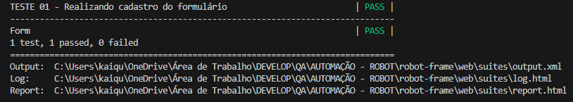
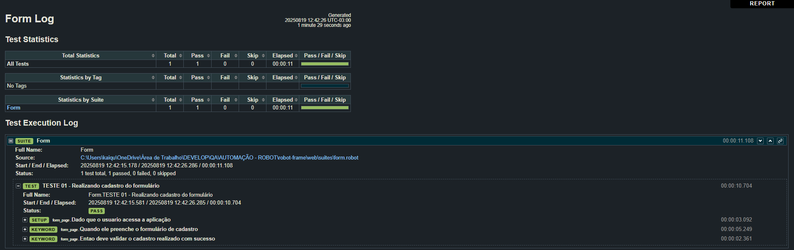
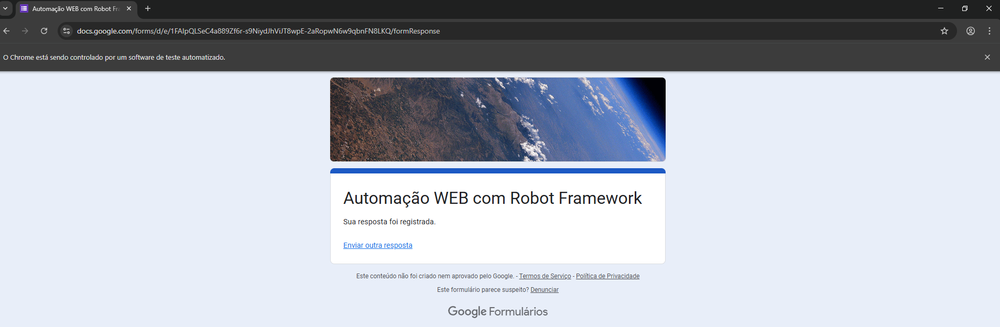

# Projeto de Automação com Robot Framework

Este projeto utiliza o Robot Framework para automatizar testes de uma aplicação web.

## Estrutura do Projeto

- `suites/`: Contém os arquivos de teste do Robot Framework.
- `resources/`: Contém arquivos de recursos, como bibliotecas e dados.

## Pré-requisitos

- Python 3.x
- Robot Framework
- SeleniumLibrary
- WebDriver para o navegador desejado (por exemplo, ChromeDriver para Google Chrome)

## Instalação

1. Clone o repositório:

   ```sh
   git clone https://github.com/seu-usuario/seu-repositorio.git
   cd seu-repositorio
   ```

2. Crie um ambiente virtual e ative-o:

   ```sh
   python -m venv venv
   .\venv\Scripts\activate  # No Windows
   source venv/bin/activate  # No Linux/Mac
   ```

3. Instale as dependências:
   ```sh
   pip install -r requirements.txt
   ```

## Executando os Testes

Para executar os testes, utilize o comando:

```sh
robot -d results tests/
```

## Exemplo e evidência de execução

Console:


Resultados:


Teste web:

